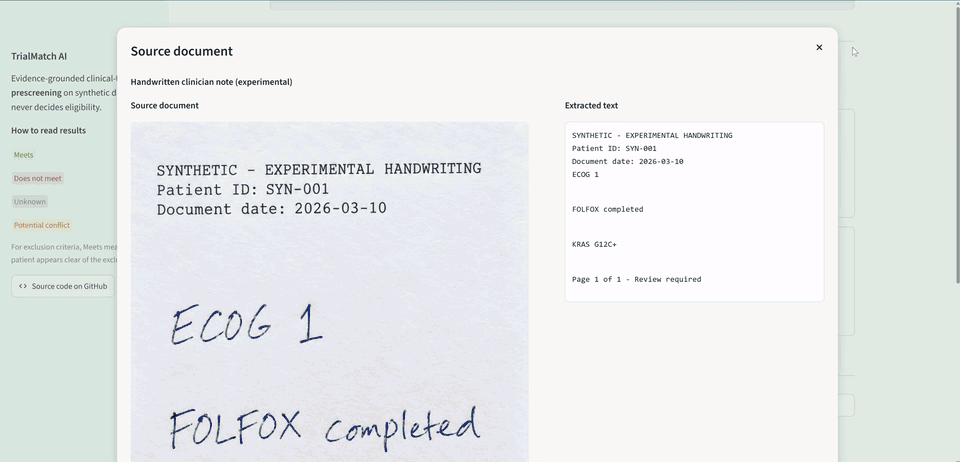
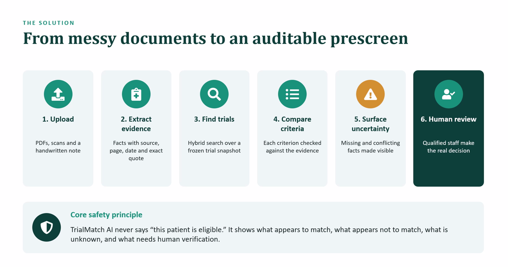
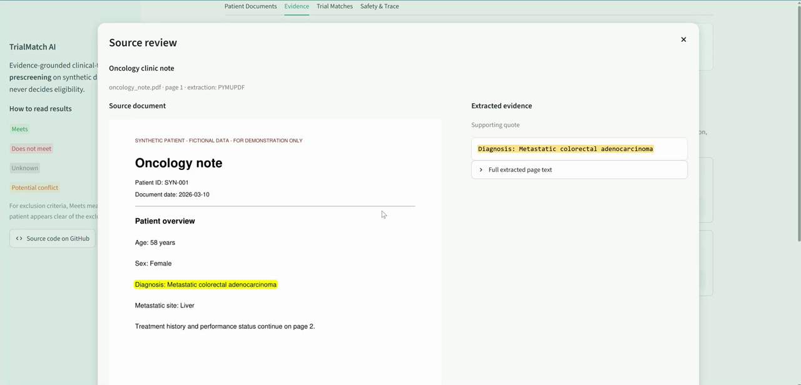
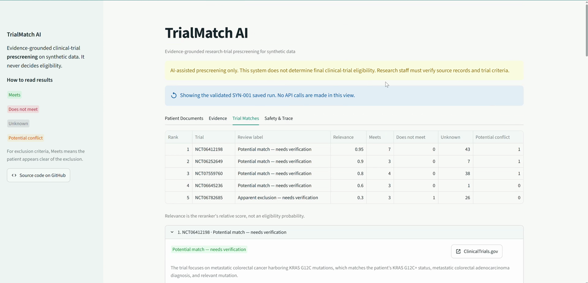
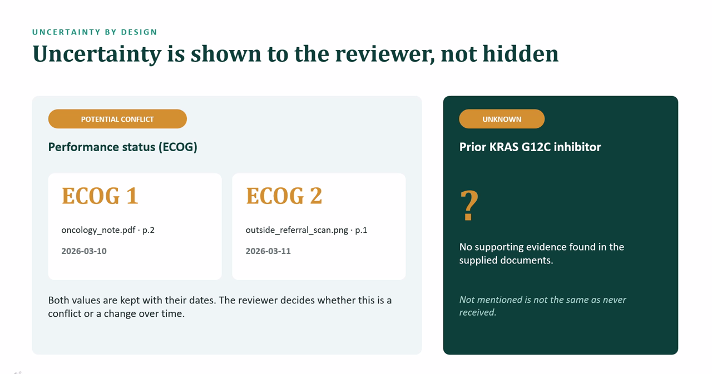

# TrialMatch AI

[](https://github.com/raghavanlakshmi/TrialMatch_AI/actions/workflows/tests.yml)


**[▶ Try the live demo](https://trialmatch-ai.streamlit.app/)** — replays a validated run on synthetic patient SYN-001; no sign-up or API key.

**Evidence-grounded, AI-assisted clinical-trial prescreening.** TrialMatch AI turns a patient's scattered
documents — PDFs, a scanned referral, a handwritten note — into source-verified facts, finds candidate
trials in a frozen ClinicalTrials.gov snapshot, and checks every eligibility criterion against the
evidence for a human reviewer.

> It never says "this patient is eligible." It shows what appears to match, what appears not to, what is
> unknown, and what needs verification. All patient data is synthetic.



## The problem

Research coordinators screen patients by reading long inclusion/exclusion lists against records spread
across oncology notes, pathology reports, labs and scanned referrals. Facts are missing, contradict each
other, or sit in handwriting. An AI shortcut that guesses through those gaps is unsafe; one that hides
its sources can't be checked.

## Results

**Criterion-level prescreening** — 29 labelled criteria from the demo trials, assessed against
synthetic patient SYN-001:

| Method | Accuracy | Decidable criteria correct | Unsafe false clearance | UNKNOWN → MEETS | False exclusion |
|---|---|---|---|---|---|
| Rule baseline (no API calls) | 83% | 58% | **0** | **0** | **0** |
| LLM assessor | **97%** | **92%** | **0** | **0** | **0** |

The rule baseline is deliberately conservative: it leaves anything it can't prove as `UNKNOWN`. The LLM
assessor resolves most of those correctly without ever clearing a patient the evidence doesn't support.

**Trial retrieval** — Recall@5 on the 16 gold cases that have a relevant trial:

| Vector (all-MiniLM-L6-v2) | BM25 | Hybrid (reciprocal rank fusion) |
|---|---|---|
| **1.00** | 0.75 | 0.875 |

Hybrid retrieval did **not** beat vector search here. Both misses are short, generic queries
("metastatic colorectal cancer") where vector search already ranks the right trial 3rd–4th and BM25
promotes other trials that repeat the same terms. Fusing at the trial level instead of the chunk level
recovers one of the two (0.94 in an offline check). With 16 cases this is a small-sample signal, and
it is listed as the next retrieval change to test.

**Tests** — 192 automated tests covering ingestion, quote verification, conflicts, missing evidence,
exclusion direction, retrieval, prompt-injection defence and UI rendering. They run offline on every push.

These are regression checks on synthetic data, not clinical validation.

## How it works



1. **Ingest** — PDFs via PyMuPDF; scans and handwriting transcribed by a vision model and flagged for review.
2. **Extract evidence** — every fact keeps its source file, page, date and an exact supporting quote. Code
   checks the quote appears word for word in the source; anything that fails is marked unverified.
3. **Find trials** — vector + BM25 search over a frozen 75-trial snapshot (55 candidates, 20 deliberate
   distractors; 1,542 parsed criteria), fused with reciprocal rank fusion, then optionally LLM-reranked.
4. **Assess criteria** — age and sex by deterministic rules; free-text criteria by a structured LLM call
   that can only cite supplied evidence.
5. **Surface uncertainty** — conflicting values are kept side by side; missing facts stay `UNKNOWN`.
6. **Human review** — a reviewer checklist records decisions and exports a summary.

**Every fact links back to its source** — the reviewer sees the quote highlighted in the original document:



**Trial matches are counts and review labels, never verdicts:**





### Safety by design

- No eligibility verdicts — enrollment language is blocked; unsupported conclusions are downgraded to `UNKNOWN`.
- Absence is not a negative: "not mentioned" never becomes "never received".
- Patient documents and trial text are treated as **data, never instructions** — a planted
  prompt-injection document is detected and ignored.
- A 12-node LangGraph workflow traces every step: timestamps, latency, counts, errors, model and LLM calls.

## Tech stack

Python 3.11 · LangGraph · OpenAI (`gpt-4.1-mini` for vision, extraction, assessment, reranking) ·
sentence-transformers · Chroma · rank-bm25 · PyMuPDF · Pydantic · Streamlit · pytest

Built with Codex as a coding assistant. The safety rules it worked under are in [AGENTS.md](AGENTS.md);
problem framing, architecture, safety boundaries and evaluation design were mine.

## Run it

```bash
git clone https://github.com/raghavanlakshmi/TrialMatch_AI.git
cd TrialMatch_AI
python -m venv .venv
source .venv/bin/activate          # Windows: .venv\Scripts\activate
pip install -r requirements.txt
streamlit run app.py
```

Or run it locally. The validated SYN-001 run loads automatically — **no API key needed**. The four tabs follow the review
flow: Patient Documents → Evidence → Trial Matches → Safety & Trace.

To analyse new uploads or refresh the assessments live, copy `.env.example` to `.env` and add an
`OPENAI_API_KEY`. A lightweight replay-only build for Streamlit Community Cloud lives in `deploy/`.

```bash
python -m pytest -q                     # 192 tests, offline
python scripts/run_eval.py              # retrieval + extraction metrics
python scripts/run_criterion_eval.py    # criterion metrics (add --llm for the live assessor)
```

## Repository layout

```
app.py              Streamlit reviewer interface
src/                ingestion, OCR, evidence extraction, retrieval, eligibility, safety, workflow
scripts/            trial download, index build, evaluation, demo validation
data/patients/      synthetic patient SYN-001 (PDFs, scan, handwritten note, injection test)
data/trials/        frozen ClinicalTrials.gov snapshot, parsed criteria, Chroma index
data/eval/          gold datasets, labels and evaluation reports
tests/              pytest suite
docs/               technical details and code organisation guide
```

Deeper write-ups: [Technical details](docs/TECHNICAL_DETAILS.md) ·
[Code organisation guide](docs/TrialMatch_AI_Code_Organization_Guide.md)

## Limitations

Synthetic data only; not clinically validated and not for real enrollment decisions. No EHR integration,
identity matching or consent handling. The trial snapshot is frozen at 2026-10-02 and will go stale as
recruitment changes. OCR and handwriting still need human review.

## License

[MIT](LICENSE)
